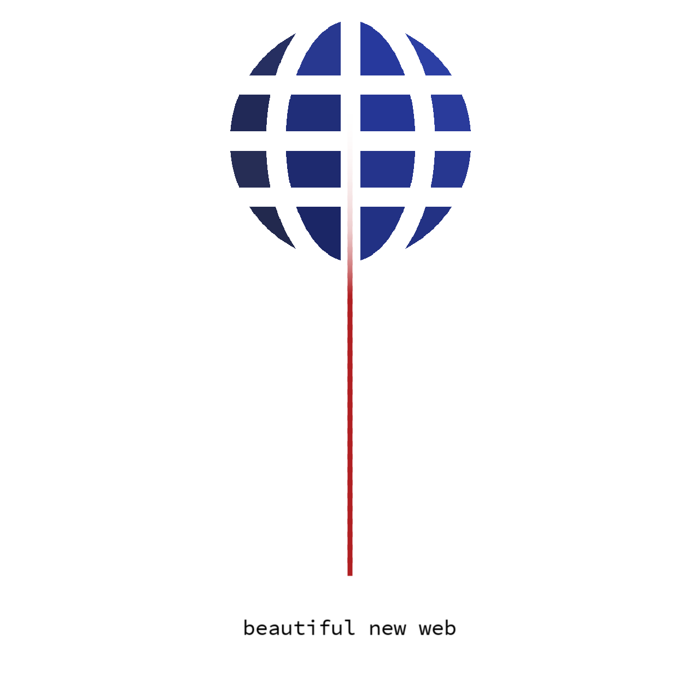

  

  

## Overview
CLI client for [I'm an inline-style link](https://github.com/piliponful/srpc-framework)

## Usage
1. `npm i -g srpc-cli`
2. `srpc --url=localhost:3000 --functionName=saveMessage --functionArguments={ "content": "test" }`
